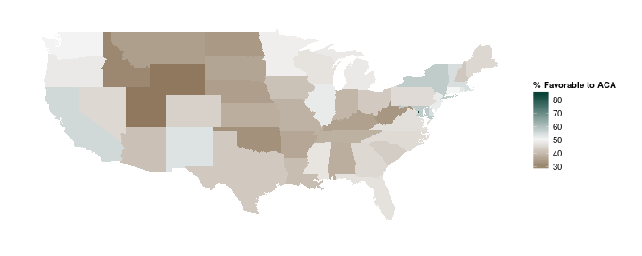

# Get the Data

If you are interested in just the state-level estimates, you can download the latest version by right-clicking [here](https://raw.githubusercontent.com/carlislerainey/ACA_Opinion/master/Data/mrp_est.csv) and then clicking "Save As." If you want to load the data directly into R, then simply run the following lines.

    library(RCurl)
    url <- "https://raw.githubusercontent.com/carlislerainey/ACA_Opinion/master/Data/mrp_est.csv"
    aca.opinion <- getURL(url)                
    aca.opinion <- read.csv(textConnection(aca.opinion))

# Overview

This repository contains state-level estimates of favorability toward the Affordable Care Act for 2012/2013 and all of the code and data (except for the original surveys from Roper) necessary to re-created them. To produce the estimates, I combine data from the Kaiser Tracking Poll from January 2012 to November 2013 (excluding December of 2012 and January, May, and July or 2013) with Census data and Obama's 2012 vote share using multilevel regression with post-stratification. I use individuals' states, sex, race (and the interaction of race and sex), age, education, and income in the poststratification ([Lax and Phillips 2009a](http://www.columbia.edu/~jhp2121/publications/HowShouldWeEstimateOpinion.pdf), [2009b](http://www.columbia.edu/~jrl2124/Lax_Phillips_Gay_Policy_Responsiveness_2009.pdf)). I rely on the [MRP package](https://github.com/malecki/mrp) to do the computation. 

The procedure estimates the percentage of citizens in each state that answered either Very Favorable or Somewhat Favorable to the [following question](http://www.ropercenter.uconn.edu/CFIDE/cf/action/ipoll/questionDetail.cfm?keyword=health%20AND%20%20reform&keywordoptions=1&exclude=&excludeOptions=1&topic=Any&organization=Kaiser&label=&fromdate=1/1/1935&toDate=12/31/2014&stitle=&sponsor=Henry%20J.%20Kaiser%20Family%20Foundation&studydate=01-JAN-34&sample=1504&qstn_list=&qstnid=1849005&qa_list=&qstn_id4=1849005&study_list=&lastSearchId=7556665&archno=&keywordDisplay=): 

> As you may know, a health reform bill was signed into law in 2010. Given what you know about the health reform law, do you have a generally favorable or generally unfavorable opinion of it? Is that a very favorable/unfavorable or somewhat favorable/unfavorable opinion?

The estimates are presented in the plots below and available for download [here](https://raw.githubusercontent.com/carlislerainey/ACA_Opinion/master/Data/mrp_est.csv). 

    
# Files

There are several parts to the projects. First, there are the original survey files available on Roper. These are not posted as part of the repository, but instead must be downloaded directly from Roper. However, the cleaned files from each survey are available.

* The directory `R_Code` contains all the R code necessary to recreate the MRP estimates, starting with the original survey data from Kaiser available on Roper.
	* The directory `Clean_Polls` contains the scripts to clean and the original survey files and recode the variables into a more usable form. The files in this directory have the form `PollingOrganization_Year_Month.R`. At this point, I'm only using data from Kaiser from January 2012 to November 2013 (except for December 2012 and January, May, and July 2013, which are not available).
	* The file `clean_poll_data.R` simply runs each script in the directory `Clean_Polls`. This cleans and recodes all of the original data sets from Roper and places them in the directory `Data/Cleaned_Poll_Data`. These data set have the name `PollingOrganization_Year_Month.csv`.
	* The file `merge_poll_data.R` simply merges all of the individual polls into a single data set called `poll_data.csv` and places it in the `Data` directory.
	* The file `mrp.R` performs the entire anlysis by sourcing the files `clean_poll_data.R` and `merge_poll_data.R`, and `create_figures.R` and then performing the MRP. It produces a file called `mrp_est.csv` and saved it in the `Data` directory. 
	* The file `create_figures.R` creates the map and line plot that summarize the MRP estimates. These figures are `mrp_est.png` and `mrp_est_map.png` and available in the `Figures` directory.
	
* The directory `Data` does not contain the original surveys from Roper, but it does contain all the derivate data sets.
	* The directory `Aggregate_Data` contains state-level data. `obama2012.csv` contains Obama's 2012 vote share in each state. `region.csv` contains the region in which each state falls. `state_names.csv` contains the state names and abbreviations.
	* The directory `Cleaned_Poll_Data` contains the cleaned versions of each of the Roper surveys. They follow the naming convention `PollingOrganization_Year_Month.csv`.
	* The file `poll_data.csv` contains the cleaned, recoded, and merged individual-level survey data. It includes the variable `aca.fav`, which indicates whether the individual views the 2010 ACA favorably or not, and the democraphic variables `sex`, `race`, `sex.race`, `age`, `education`, and `income`, all with the obvious meanings.
	* The file `mrp_est.csv` contains the variables `percent_favorable_aca`, which are the state-level MRP estimates, and `state_abbr`.
	
# Original Data

The original data are not included as part of the repository, but are available for download from Roper. Below are links to the survey data.

* Kaiser Family Foundation Health Tracking Poll.
    * [January 2012](http://www.ropercenter.uconn.edu/CFIDE/cf/action/catalog/abstract.cfm?type=&start=&id=&archno=USPSRA2012-HNI106&abstract=)
    * [February 2012](http://www.ropercenter.uconn.edu/CFIDE/cf/action/catalog/abstract.cfm?type=&start=&id=&archno=USPSRA2012-HNI107&abstract=)
	* [March 2012](http://www.ropercenter.uconn.edu/CFIDE/cf/action/catalog/abstract.cfm?type=&start=&id=&archno=USPSRA2012-HNI108&abstract=)
	* [April 2012](http://www.ropercenter.uconn.edu/CFIDE/cf/action/catalog/abstract.cfm?type=&start=&id=&archno=USPSRA2012-HNI109&abstract=)
	* [May 2012](http://www.ropercenter.uconn.edu/CFIDE/cf/action/catalog/abstract.cfm?type=&start=&id=&archno=USPSRA2012-HNI110&abstract=)
	* [June 2012](http://www.ropercenter.uconn.edu/CFIDE/cf/action/catalog/abstract.cfm?type=&start=&id=&archno=USPSRA2012-HNI111&abstract=)
	* [July 2012](http://www.ropercenter.uconn.edu/CFIDE/cf/action/catalog/abstract.cfm?type=&start=&id=&archno=USPSRA2012-HNI112&abstract=)
	* [August 2012](http://www.ropercenter.uconn.edu/CFIDE/cf/action/catalog/abstract.cfm?type=&start=&id=&archno=USPSRA2012-HNI113&abstract=)
	* [September 2012](http://www.ropercenter.uconn.edu/CFIDE/cf/action/catalog/abstract.cfm?type=&start=&id=&archno=USPSRA2012-HNI114&abstract=)
	* [October 2012](http://www.ropercenter.uconn.edu/CFIDE/cf/action/catalog/abstract.cfm?type=&start=&id=&archno=USPSRA2012-HNI115&abstract=)
	* [November 2012](http://www.ropercenter.uconn.edu/CFIDE/cf/action/catalog/abstract.cfm?type=&start=&id=&archno=USPSRA2012-HNI116&abstract=)
	* [February 2013](http://www.ropercenter.uconn.edu/CFIDE/cf/action/catalog/abstract.cfm?type=&start=&id=&archno=USPSRA2013-HNI117&abstract=)
	* [March 2013](http://www.ropercenter.uconn.edu/CFIDE/cf/action/catalog/abstract.cfm?type=&start=&id=&archno=USPSRA2013-HNI118&abstract=)
	* [April 2013](http://www.ropercenter.uconn.edu/CFIDE/cf/action/catalog/abstract.cfm?type=&start=&id=&archno=USPSRA2013-HNI119&abstract=)
	* [June 2013](http://www.ropercenter.uconn.edu/CFIDE/cf/action/catalog/abstract.cfm?type=&start=&id=&archno=USPSRA2013-HNI120&abstract=)
	* [August 2013](http://www.ropercenter.uconn.edu/CFIDE/cf/action/catalog/abstract.cfm?type=&start=&id=&archno=USPSRA2013-HNI121&abstract=)
	* [September 2013](http://www.ropercenter.uconn.edu/CFIDE/cf/action/catalog/abstract.cfm?type=&start=&id=&archno=USPSRA2013-HNI122&abstract=)
	* [October 2013](http://www.ropercenter.uconn.edu/CFIDE/cf/action/catalog/abstract.cfm?type=&start=&id=&archno=USPSRA2013-HNI123&abstract=)
	* [November 2013](http://www.ropercenter.uconn.edu/CFIDE/cf/action/catalog/abstract.cfm?type=&start=&id=&archno=USPSRA2013-HNI124&abstract=)