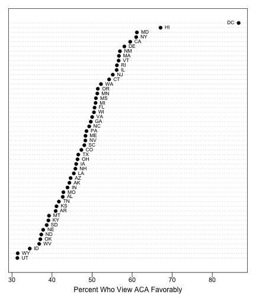

# Overview

This repository contains state-level estimates of favorability toward the Affordable Care Act for 2013. I combine data from the Kaiser Tracking Poll from February 2013 to November 2013 (excluding May and July) using multilevel regression with post-stratification.

The procedure estimates the percentage of citizens in each state that answered either Very Favorable or Somewhat Favorable to the following question: 

> As you may know, a health reform bill was signed into law in 2010. Given what you know about the health reform law, do you have a generally favorable or generally unfavorable opinion of it? Is that a very favorable/unfavorable or somewhat favorable/unfavorable opinion?

The estimates are presented in the plot below.

If you are interested in just the state-level estimates, you can download the latest version by right-clicking [here](https://raw.githubusercontent.com/carlislerainey/ACA_Opinion/master/Data/mrp_est.csv) and "Save As." If you want to load the data directly into R, then you can simply run the following lines in R.

    library(RCurl)
    url <- "https://raw.githubusercontent.com/carlislerainey/ACA_Opinion/master/Data/mrp_est.csv"
    aca.opinion <- getURL(url)                
    aca.opinion <- read.csv(textConnection(aca.opinion))
    
# Files

There are several parts to the projects. First, there are the original survey files available on Roper. These are not posted as part of the repository, but instead must be downloaded directly from Roper. However, the cleaned files from each survey are available.

* The directory `R_Code` contains all the R code necessary to recreate the MRP estimates, starting with the original survey data from Kaiser available on Roper.
	* The directory `Clean_Polls` contains the scripts to clean and the original survey files and recode the variables into a more usable form. The files in this directory have the form `PollingOrganization_Year_Month.R`. At this point, I'm only using data from Kaiser from February 2013 to November 2013.
	* The file `clean_poll_data.R` simply runs each script in the directory `Clean_Polls`. This cleans and recodes all of the original data sets from Roper and places them in the directory `Data/Cleaned_Poll_Data`. These data set have the name `PollingOrganization_Year_Month.csv`.
	* The file `merge_poll_data.R` simply merges all of the individual polls into a single data set called `poll_data.csv` and places it in the `Data` directory.
	* The file `mrp.R` performs the entire anlysis by sourcing the files `clean_poll_data.R` and `merge_poll_data.R` and then performing the MRP. It produces a file called `mrp_est.csv` and saved it in the `Data` directory.
* The `Data` directory does not contain the original surveys from Roper, but it does contain all the derivate data sets.
	* The directory `Aggregate_Data` contains state-level data. `obama2012.csv` contains Obama's 2012 vote share in each state. `region.csv` contains the region in which each state falls. `state_names.csv` contains the state names and abbreviations.
	* The directory `Cleaned_Poll_Data` contains the cleaned versions of each of the Roper surveys. They follow the naming convention `PollingOrganization_Year_Month.csv`.
	
# Original Data

The original data are not included as part of the repository, but are available for download from Roper. Below are links to the survey data.

* Kaiser Family Foundation Health Tracking Poll.
	* [February](http://www.ropercenter.uconn.edu/CFIDE/cf/action/catalog/abstract.cfm?type=&start=&id=&archno=USPSRA2013-HNI117&abstract=)
	* [March](http://www.ropercenter.uconn.edu/CFIDE/cf/action/catalog/abstract.cfm?type=&start=&id=&archno=USPSRA2013-HNI118&abstract=)
	* [April](http://www.ropercenter.uconn.edu/CFIDE/cf/action/catalog/abstract.cfm?type=&start=&id=&archno=USPSRA2013-HNI119&abstract=)
	* [June](http://www.ropercenter.uconn.edu/CFIDE/cf/action/catalog/abstract.cfm?type=&start=&id=&archno=USPSRA2013-HNI120&abstract=)
	* [August](http://www.ropercenter.uconn.edu/CFIDE/cf/action/catalog/abstract.cfm?type=&start=&id=&archno=USPSRA2013-HNI121&abstract=)
	* [September](http://www.ropercenter.uconn.edu/CFIDE/cf/action/catalog/abstract.cfm?type=&start=&id=&archno=USPSRA2013-HNI122&abstract=)
	* [October](http://www.ropercenter.uconn.edu/CFIDE/cf/action/catalog/abstract.cfm?type=&start=&id=&archno=USPSRA2013-HNI123&abstract=)
	* [November](http://www.ropercenter.uconn.edu/CFIDE/cf/action/catalog/abstract.cfm?type=&start=&id=&archno=USPSRA2013-HNI124&abstract=)